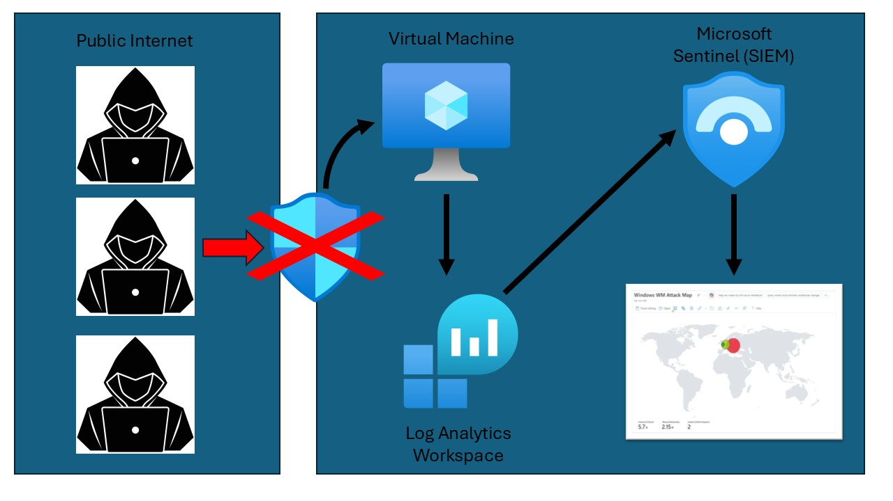
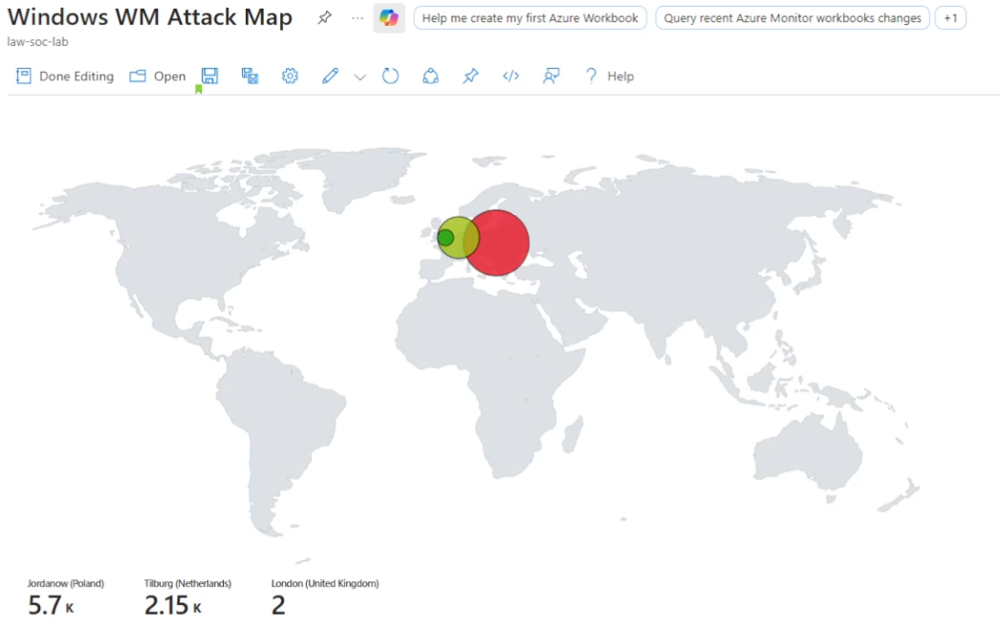

# Guía: Creación de un SOC Lab en Azure

Esta guía detalla el proceso de configuración de un laboratorio de SOC (Security Operations Center) utilizando recursos de Azure, Microsoft Sentinel y Log Analytics.




## 1. Configuración de la Infraestructura Base

### Crear el Grupo de Recursos y Red Virtual
* **Resource Group:** Crear un grupo llamado `HH-SOC-Lab` para agrupar todos los recursos del proyecto.
* **Virtual Network:** Crear la red `VNET-SOC-Lab` y asignarla al grupo de recursos creado.

### Crear la Máquina Virtual (Target/HoneyPot)
* Crear una máquina virtual llamada `CORP-NET-HH-1`.
* **Sistema Operativo:** Seleccionar Windows 10 Enterprise (versión 22H2).
* **Verificación:** Una vez creada, confirmar en el panel de Azure que el estado es "Running" y todos los recursos asociados (IP pública, NSG, Disco) se han desplegado correctamente.

## 2. Configuración de Seguridad y Exposición

Para que el laboratorio pueda recibir ataques (simulados o reales para monitoreo), es necesario ajustar las reglas de firewall.

### Ajustar el Network Security Group (NSG)
* Acceder a las configuraciones del firewall de la VM.
* Eliminar la regla RDP existente que restringe el acceso.
* Crear una nueva regla de entrada:
  * **Nombre:** `PELIGRO_AllowAnyCustomAnyInbound`
  * **Acción:** Allow (Permitir todo el tráfico entrante para máxima exposición).

### Configuración Interna de la VM
* Acceder a la VM mediante Escritorio Remoto utilizando su IP pública.
* **Privacidad:** Al iniciar, desactivar todas las opciones de seguridad y diagnóstico de Windows.
* **Desactivar el Firewall de Windows:**
  * Ejecutar `wf.msc`.
  * Desactivar las propiedades del Firewall para los perfiles de Dominio, Privado y Público.
* **Prueba de Exposición:** Realizar un ping a la dirección IP pública de la máquina desde un equipo externo para verificar que responde.

## 3. Implementación del SOC (Monitoreo)

### Log Analytics y Microsoft Sentinel
* **Log Analytics Workspace:** Crear un nuevo workspace llamado `LAW-SOC-LAB-001` en la región correspondiente.
* **Microsoft Sentinel:** Agregar el workspace creado anteriormente a Microsoft Sentinel.

### Conector de Datos
* Ir al Content Hub en Sentinel.
* Buscar e instalar el conector de **Windows Security Events**.
* Configurar la regla de recolección de datos (Data Collection Rule - DCR) y seleccionar la VM `CORP-NET-HH-1`.
* Seleccionar la opción de recolectar **All Security Events**.

### Enriquecimiento de Datos con Watchlists
Para geolocalizar los ataques, se utiliza una Watchlist con bases de datos de IP:
* En Sentinel, ir a la sección de Watchlist y crear una nueva llamada `geoip`.
* Cargar el archivo CSV que contiene la relación de IPs por países y coordenadas.

## 4. Visualización: Mapa de Ataques

Para visualizar los intentos de inicio de sesión fallidos en un mapa, se utiliza un Workbook con la siguiente consulta KQL:

```kql
let GeoIPDB_FULL = _GetWatchlist("geoip");
let WindowsEvents = SecurityEvent;
WindowsEvents 
| where EventID == 4625
| order by TimeGenerated desc
| evaluate ipv4_lookup(GeoIPDB_FULL, IpAddress, network)
| summarize FailureCount = count() by IpAddress, latitude, longitude, cityname, countryname
| project FailureCount, AttackerIp = IpAddress, latitude, longitude, city = cityname, country = countryname,
friendly_location = strcat(cityname, " (", countryname, ")");
```

